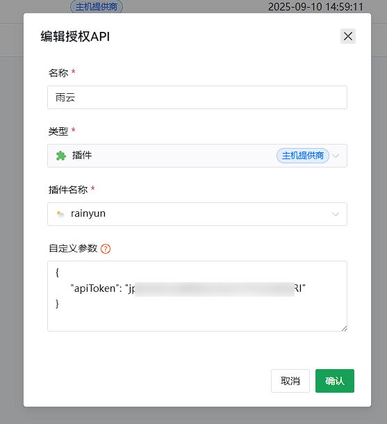

# Rainyun SSL 插件

这是一个由 AI 编写的 Rainyun（雨云：rainyun.com）插件，用于自动化管理 SSL 证书的上传和替换。

## 功能概述
- **自动申请 SSL 证书**：支持通过 API 自动申请 SSL 证书，简化证书管理流程。
- **证书上传**：将申请到的证书安全上传至 Rainyun 平台，确保数据加密传输。
- **证书替换**：支持无缝替换已存在的 SSL 证书，无需手动操作。

## 使用场景
- **开发者**：适用于需要自动化管理 SSL 证书的开发者，提升工作效率。
- **管理员**：帮助 Rainyun 平台管理员简化证书管理流程，降低人工干预。

## 安装与配置
## 下载插件
- [Windows 64位版本 (rainyun-64.exe)](/plugins-build/rainyun-64.exe)
- [Windows 32位版本 (rainyun-86.exe)](/plugins-build/rainyun-86.exe)
- [Linux AMD64 版本 (rainyun-amd64)](/plugins-build/rainyun-amd64)
- [Linux ARM64 版本 (rainyun-arm64)](/plugins-build/rainyun-arm64)
1. **下载插件**：将插件解压到 `allinssl` 运行目录的 `/plugins/` 文件夹中。

2. **配置 API 密钥**：在 Rainyun 平台获取 API 密钥，并填写到配置文件中。

3. **配置自动化**：设置自动化任务，插件将自动完成证书申请和上传。

## 项目结构
```
/workspace
├── plugins-build                  # 预编译的插件文件夹
├── plugins-example-doge           # 示例插件（用于 AI 训练）
├── plugins-example-kuocai         # 示例插件（用于 AI 训练）
├── rainyun                        # Rainyun SSL 插件主目录
└── README.md                      # 项目说明文档
```

## 注意事项
- **权限要求**：确保 Rainyun 账户具有足够的权限以执行证书管理操作。
- **配置准确性**：配置文件中的域名和 API 信息必须准确无误，否则可能导致操作失败。
- **如无权限执行**：尝试：chmod +x ./plugins/rainyun-amd64

## 编译插件
- **初始化**: cd /workspace/rainyun && go mod init rainyun

### Windows-64
```bash
cd /workspace/rainyun && GOOS=windows GOARCH=amd64 go build -o ../plugins-build/rainyun-64.exe
```
### Windows-32
```bash
cd /workspace/rainyun && GOOS=windows GOARCH=386 go build -o ../plugins-build/rainyun-86.exe
```
### Linux-amd
```bash
cd /workspace/rainyun && GOOS=linux GOARCH=amd64 go build -o ../plugins-build/rainyun-amd64
```
### Linux-arm
```bash
cd /workspace/rainyun && GOOS=linux GOARCH=arm64 go build -o ../plugins-build/rainyun-arm64
```